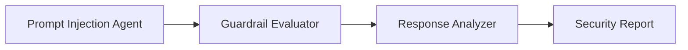

# 👋 Hi, I'm Sadelco

🚀 **LLM/AI Security Researcher | Cybersecurity Engineer | AI Agent Builder | Red Team Tester **

I build **AI security testing systems, autonomous agents, and LLM red-team tools** using modern frameworks like **CrewAI, Ollama, Docker, and Python**.

My work focuses on the **security of Large Language Models (LLMs)** — including **prompt injection, guardrail evaluation, and adversarial testing pipelines**.

---

# 🔐 Current Focus

- 🤖 Building **AI agent systems**
- 🛡️ Red-teaming **Large Language Models**
- 🧠 Exploring **AI security & adversarial attacks**
- ⚙️ Creating **local LLM pipelines with Ollama**
- 🧪 Developing **AI testing frameworks**

---

# 🧠 AI Security Lab

I'm currently building a **multi-stage AI security testing lab** using autonomous agents.

### Current pipeline

### Projects

| Project | Description |
|------|------|
| `09_basic_agent` | First CrewAI autonomous agent |
| `10_prompt_injection_tester` | Adversarial prompt generator |
| `11_guardrail_evaluator` | Guardrail behaviour analysis |
| `12_response_analyzer` | LLM output security classification |
| `13_live_llm_attack_tester` | Live attacks |
| `14_multi_prompt_attack_runner` | Batch testing |
| `15_multi_model_attack_comparator` | Model comparison |
| `16_yaml_prompt_runner` | Config-driven execution |
| `17_scoring_engine` | Quantitative scoring |
| `18_report_exporter` | **Persistent reporting & exports** |

---

# 🛠 Tech Stack

### AI / LLM
- Python
- CrewAI
- Ollama
- LangChain
- Promptfoo
- DeepEval

### Security
- AI Red Teaming
- Prompt Injection Testing
- Guardrail Analysis
- LLM Safety Evaluation

### Engineering
- Docker
- Docker Compose
- Linux
- Git / GitHub
- VS Code

---

# 📚 Education

🎓 **MSc Cybersecurity, Privacy & Trust**

Research focus:

**Security vulnerabilities in Large Language Models**

Topics explored:

- Prompt injection attacks
- Model jailbreak techniques
- LLM data leakage
- AI safety guardrails

---

# 🚧 Current Projects

### AI Agent Lab

A structured lab environment for building and testing autonomous AI systems.

Features:

- Local LLM infrastructure
- Multi-agent orchestration
- Security evaluation pipelines
- Containerised runtime environments

---

# 🎯 Career Direction

I'm transitioning into roles involving:

- **AI Security Engineering**
- **LLM Safety & Red Teaming**
- **AI Infrastructure Engineering**
- **Autonomous Agent Systems**

---

# 🤝 Let's Connect

- 💼 LinkedIn
- 🔐 Cybersecurity
- 🤖 AI Safety
- 🧠 Autonomous AI Systems

---

⭐ If you're interested in **AI security, LLM safety, or agent systems**, feel free to explore my projects.
